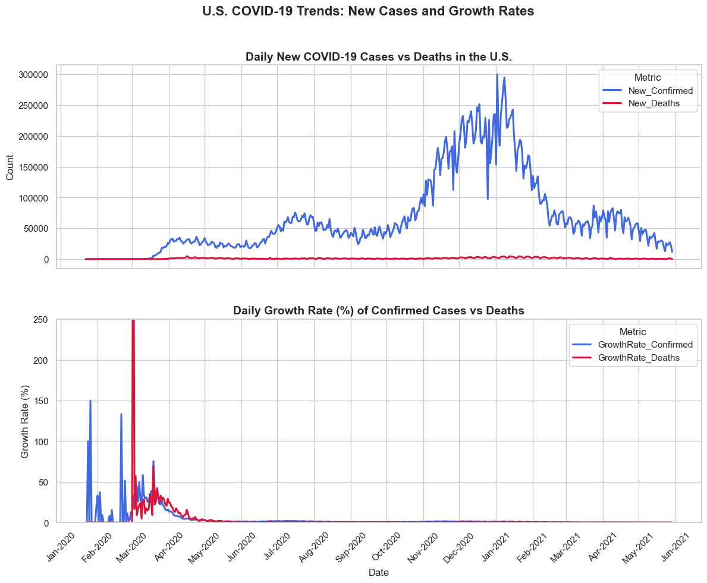

# Project Overview

This project analyzes the **COVID-19 pandemic trends in the United States**, focusing on understanding the relationship between **confirmed, recovered, and death cases** over time.
Using Python’s data analysis and visualization libraries, the project explores how the virus spread, identifies statistical patterns, and tests the strength of relationships between key variables.


## Objectives

* Clean and preprocess real-world COVID-19 data for accurate analysis.
* Visualize trends of confirmed, recovered, and death cases over time.
* Calculate daily new cases and growth rates to capture short-term changes.
* Perform **statistical tests** and **correlation analysis** to understand relationships between variables.
* Apply **linear regression** using `statsmodels` to measure how confirmed cases predict deaths.


## Key Analyses

* **Trend Visualization:** Line plots showing the progression of confirmed, recovered, and death cases in the U.S.
* **Correlation Analysis:** Pearson correlation test between confirmed and death cases
  → *Result: r ≈ 0.99, p ≈ 0*, indicating a strong and statistically significant positive correlation.
* **Regression Modeling:** Built a simple linear regression model to predict deaths from confirmed cases using `statsmodels.OLS`.
* **Hypothesis Testing:** Applied statistical tests to compare data patterns and validate relationships.


## Tools & Technologies

* **Python Libraries:** `pandas`, `numpy`, `matplotlib`, `seaborn`, `scipy`, `statsmodels`
* **Environment:** Jupyter Notebook / VS Code / Anaconda / GitHub


## Key Findings

* There is an **extremely strong positive correlation** between confirmed and death cases (r ≈ 0.99).
* The **p-value ≈ 0**, confirming that this relationship is **statistically significant**.
* The visual trends show that as confirmed cases rise, deaths also increase proportionally, following a consistent linear pattern.

## Next Steps

* Extend the analysis to include **state-level comparisons** within the U.S.
* Build **forecasting models** (e.g., ARIMA or Prophet) to predict future trends.
* Create an **interactive dashboard** for dynamic exploration of the results.


# Goal
1. **Assess the global impact of COVID-19:** Analyze how severely different countries were affected in terms of 2- confirmed cases, deaths, and recovery rates.

2. **Apply Python for real-world data exploration:** Use data analysis tools and visualization techniques to uncover meaningful trends and relationships within real COVID-19 datasets.

3. **Provide actionable public insights:** Translate findings into practical insights that can help identify which regions experienced lower infection and death rates — offering guidance on safer places to live or travel.


# Questions

1. **What were the top five countries with the highest number of confirmed COVID-19 cases between 2020 and 2021?**

2. **What was the cumulative growth of confirmed COVID-19 cases over time globally?**

3. **How did the number of daily confirmed cases compare to daily deaths in the United States during 2021?**

4. **What was the pattern of daily active, recovered, and deceased COVID-19 cases in the United States from 2020 to 2021?**

5. **What was the volatility of daily confirmed and daily death cases in the United States?**

6. **Is there a correlation between confirmed cases, recovered cases, and deaths in the United States during the pandemic period (2020–2021)?**

7. **What is the US COVID-19 Trends of New Cases and Growth Rates**

8. **Has the average growth rate of confirmed cases significantly changed after July 2020?**

9. **Is there a significant relationship between confirmed cases and deaths?**

10. **Can we predict deaths from confirmed cases using a linear regression model?**


# Data Cleaning

Before performing any analysis, the dataset was cleaned and prepared to ensure accuracy and consistency.
The following steps were applied:

```
import ast 
import numpy as np
import pandas as pd
import matplotlib.pyplot as plt
import seaborn as sns
import matplotlib.ticker as mtick
import matplotlib.dates as mdates

# Set the path to the file you'd like to load
file_path = 'M:/3_datasets/covid_19_data.csv'

# Load the latest version
df = pd.read_csv(file_path)

#clean
df['ObservationDate']= pd.to_datetime(df['ObservationDate'])

df.columns = df.columns.str.replace(' ', '_')
df['Last_Update'] = pd.to_datetime(df['Last_Update'], format='mixed') 
# df['Last_Update'] = pd.to_datetime(df['Last_Update'], format='%m/%d/%y %H:%M', errors='coerce')
# we can also use that format but we cant bec our data include more than one time format for instance (1/22/2020 17:00, 2021-05-30)
# so mixed sayes that me have more than one format

df.set_index('SNo', inplace=True)

df['Country/Region']= df['Country/Region'].fillna('else')
df['Province/State']= df['Province/State'].fillna('else')

df[['Confirmed','Deaths','Recovered']] = df[['Confirmed','Deaths','Recovered']].clip(lower=0) # replace -ve values with 0
```

1. **Data Import & Conversion**

   * Loaded the dataset from the specified path:

     ```python
     df = pd.read_csv('M:/3_datasets/covid_19_data.csv')
     ```
   * Converted the `ObservationDate` column to a proper datetime format:

     ```python
     df['ObservationDate'] = pd.to_datetime(df['ObservationDate'])
     ```
   * Standardized column names by replacing spaces with underscores:

     ```python
     df.columns = df.columns.str.replace(' ', '_')
     ```

2. **Handling Mixed Date Formats**

   * The `Last_Update` column contained multiple date formats (e.g., `1/22/2020 17:00` and `2021-05-30`).
     To correctly parse all variations, the `format='mixed'` parameter was used:

     ```python
     df['Last_Update'] = pd.to_datetime(df['Last_Update'], format='mixed')
     ```

3. **Indexing**

   * The `SNo` column was set as the dataset index for better data management:

     ```python
     df.set_index('SNo', inplace=True)
     ```

4. **Missing Data Handling**

   * Filled missing values in `Country/Region` and `Province/State` with `'else'` to maintain data consistency:

     ```python
     df['Country/Region'] = df['Country/Region'].fillna('else')
     df['Province/State'] = df['Province/State'].fillna('else')
     ```

5. **Data Validation**

   * Ensured that negative values in `Confirmed`, `Deaths`, and `Recovered` columns were replaced with zero to avoid invalid entries:

     ```python
     df[['Confirmed', 'Deaths', 'Recovered']] = df[['Confirmed', 'Deaths', 'Recovered']].clip(lower=0)
     ```


### **Result**

After cleaning, the dataset was fully standardized:

* All dates are in consistent datetime format.
* No missing country or province names.
* No negative counts in case numbers.
* Data is ready for accurate statistical analysis and visualization.


# The Analysis

## 1. What were the top five countries with the highest number of confirmed COVID-19 cases between 2020 and 2021?

The analysis focused on identifying the countries most affected by COVID-19 based on the total number of confirmed cases reported between 2020 and 2021. The dataset was first filtered to include data up to May 29, 2021, ensuring that each country’s cumulative case count was accurately captured. The data was then grouped by Country/Region and the total number of confirmed cases was summed for each country. After sorting the results in descending order, the top five countries were selected for visualization.

To illustrate the findings, a horizontal bar chart was created using Seaborn, showing the United States, India, Brazil, France, and Turkey as the countries with the highest number of confirmed cases. Each bar represented the total confirmed cases per country, labeled with exact values for clarity. This visualization provided a clear comparison of how the pandemic’s impact varied globally, emphasizing the significant gap between the United States and other nations in total infections.


View my notebook in details here:
[1_EDA_Intro.ipynb](1_EDA_Intro.ipynb)


### Visualize data 

```
sns.set_theme(style="whitegrid")

df_sns= sns.barplot(data=df_plot, x='Confirmed', y='Country/Region', palette='mako')

for index, value in enumerate(df_plot['Confirmed']):
    plt.text(value +50000, index, f'{int(value):,}')

plt.gca().xaxis.set_major_formatter(mtick.StrMethodFormatter('{x:,.0f}'))
df_sns.set_xlabel('Number of Confirmed Cases')
df_sns.set_ylabel('Countries')
plt.title('Top 5 Countries by Confirmed COVID-19 in (2021-05-29)')
plt.xticks(rotation=45)
df_sns.set_xlim(0, 35000000)

sns.despine()
plt.show()
```


### Results


### Insights

The bar chart illustrates the **top five countries with the highest number of confirmed COVID-19 cases** as of **May 29, 2021**. The data shows how the pandemic affected different regions globally.

* **United States:** Recorded the highest number of confirmed cases, approximately **33.25 million**, indicating the most widespread outbreak among all countries.
* **India:** Reported around **27.89 million** confirmed cases, reflecting the severe impact of the second wave during 2021.
* **Brazil:** Ranked third with about **16.47 million** cases, showing the extensive spread of the virus in South America.
* **France:** Reported around **5.72 million** confirmed cases.
* **Turkey:** Recorded approximately **5.23 million** confirmed cases.

The chart demonstrates a **significant gap** between the United States and other countries, highlighting the scale of infections within the U.S. population. India’s and Brazil’s high numbers also reveal how large populations and healthcare pressures influenced total case counts. France and Turkey, while still heavily affected, experienced relatively fewer infections compared to the top three nations.

Overall, the visualization provides a clear comparison of the global distribution of COVID-19 cases, emphasizing how **infection levels varied widely across different regions of the world**.


## 2. What was the cumulative growth of confirmed COVID-19 cases over time globally?

The analysis focused on understanding how COVID-19 spread worldwide between January 2020 and May 2021 by examining the cumulative growth of confirmed, recovered, and death cases. The dataset contained global daily reports of COVID-19, including the number of confirmed cases, deaths, and recoveries for each country.

To prepare the data, the entries were grouped by date, and the total counts for each category (Confirmed, Deaths, Recovered) were summed to represent the global situation for each day. After aggregating the data, a stacked area plot was created to visualize how these three measures evolved over time.

The red area in the plot represents confirmed cases, showing a steady rise throughout 2020 and a sharp increase during late 2020 and early 2021, reflecting the global spread of the virus. The green area represents recovered cases, which also increased significantly, indicating successful recovery efforts across countries. The blue area, though much thinner, represents deaths, showing a slower but continuous increase.

Overall, the visualization reveals the exponential nature of the pandemic’s growth, the scale of global recoveries, and the ongoing impact of deaths, offering a clear overview of how COVID-19 evolved globally during this period.

View my notebook in details here:
[1_EDA_Intro.ipynb](1_EDA_Intro.ipynb)


### Visualize data


```
sns.set_theme(style="whitegrid")


plt.figure(figsize=(12, 6))
ax = plt.gca()  # Get the current Axes

ax.stackplot(
    global_daily['ObservationDate'],
    global_daily['Confirmed'],
    global_daily['Deaths'],
    global_daily['Recovered'],
    labels=['Confirmed', 'Deaths', 'Recovered'],
    colors=['#ff9999', '#9999ff', "#99ff99"],  
    alpha=0.8
)

ax.xaxis.set_major_formatter(mdates.DateFormatter('%b-%Y'))
ax.yaxis.set_major_formatter(mtick.FuncFormatter(lambda x, _: f'{int(x):,}'))

sns.despine()

plt.title('Global Cumulative COVID-19 Growth Over Time', fontsize=14, pad=12)
plt.xlabel('Date')
plt.ylabel('Number of Cases')
plt.legend(loc='upper left')

plt.tight_layout(rect=[0, 0, 1, 0.96])
plt.show()
```

### Results


### Insights

This plot illustrates the global cumulative growth of COVID-19 cases, deaths, and recoveries from January 2020 to May 2021. The dataset was grouped by date to aggregate the total confirmed, death, and recovered cases worldwide for each day. Using this data, a stacked area chart was created to visually represent how the pandemic evolved over time.

The red area represents confirmed cases, showing a steady rise throughout 2020, followed by a sharp increase during late 2020 and early 2021, indicating the widespread global surge in infections. The green area represents recoveries, which also grew significantly over time, reflecting global efforts to treat and control the disease. The blue area, much thinner in comparison, represents deaths, showing a slower but consistent increase.

Overall, the visualization highlights the exponential nature of the pandemic’s spread, the large number of recoveries achieved, and the global health challenge posed by COVID-19 during this period. The stacked design makes it easy to compare the trends and proportions of confirmed, recovered, and death cases across time.

## 3. How did the number of daily confirmed cases compare to daily deaths in the United States during 2021?

I grouped the dataset by month and state to calculate the total number of confirmed cases and deaths for the first half of 2021. Then, I aggregated these monthly totals for the top three most affected states—California, Florida, and Texas—and computed the mean across all states for comparison. The data was visualized in two separate line charts: one for monthly confirmed cases and another for monthly deaths, both using clear labels and markers.

The first chart shows that confirmed cases sharply declined from January to May 2021 across all three states, with California having the highest counts. The second chart shows a similar downward trend for deaths, indicating that as infections decreased, mortality also declined. Overall, both confirmed cases and deaths followed parallel downward trends throughout the first half of 2021.

View my notebook in details here:
[2_Monthly_confirmed_VS_Deaths.ipynb](2_Monthly_confirmed_VS_Deaths.ipynb)


### Visualize data

```
sns.set_theme(style="whitegrid")

fig, ax = plt.subplots(2, 1, figsize=(12, 12))

# ------------------ Confirmed cases ------------------
sns.lineplot(data=df_pivot_confirmed, markers='o', palette='mako', ax=ax[0])

ax[0].yaxis.set_major_formatter(mtick.FuncFormatter(lambda x, _: f'{int(x):,}'))
ymin, ymax = ax[0].get_ylim()
ax[0].set_yticks(np.linspace(ymin, ymax, 10))

ax[0].set_title("Monthly Confirmed Cases in the first half of 2021 in USA", fontsize=14)
ax[0].set_xlabel("Month")
ax[0].set_ylabel("Confirmed Cases")

# Add value labels with automatic overlap adjustment
texts_confirmed = []
for line in ax[0].lines:
    x_data = line.get_xdata()
    y_data = line.get_ydata()
    for x, y in zip(x_data, y_data):
        texts_confirmed.append(
            ax[0].text(x, y, f'{int(y):,}', fontsize=8, ha='center', va='bottom')
        )

adjust_text(texts_confirmed, ax=ax[0], arrowprops=dict(arrowstyle="-", color='r', lw=0.5))


# ------------------ Deaths ------------------
sns.lineplot(data=df_pivot_deathes, markers='o', palette='mako', ax=ax[1])

ax[1].yaxis.set_major_formatter(mtick.FuncFormatter(lambda x, _: f'{int(x):,}'))
ymin, ymax = ax[1].get_ylim()
ax[1].set_yticks(np.linspace(ymin, ymax, 10))

ax[1].set_title("Monthly Deaths in the first half of 2021 in USA", fontsize=14)
ax[1].set_xlabel("Month")
ax[1].set_ylabel("Deaths")

# Add value labels with automatic overlap adjustment
texts_deaths = []
for line in ax[1].lines:
    x_data = line.get_xdata()
    y_data = line.get_ydata()
    for x, y in zip(x_data, y_data):
        texts_deaths.append(
            ax[1].text(x, y, f'{int(y):,}', fontsize=8, ha='center', va='bottom')
        )

adjust_text(texts_deaths, ax=ax[1], arrowprops=dict(arrowstyle="-", color='r', lw=0.5))

plt.tight_layout(rect=[0, 0, 1, 0.96])
plt.show()

```

### Results


### Insights

This visualization compares the monthly confirmed COVID-19 cases and deaths in California, Florida, and Texas during the first half of 2021. The dataset was grouped by month and state to calculate total cases and deaths, with mean values included for comparison.

The top chart shows a sharp decline in confirmed cases from January to May 2021, with California starting the year at the highest level before all three states experienced significant drops. The lower chart mirrors this trend for deaths, which decreased steadily as case numbers fell.

Overall, the plots highlight a clear downward trend in both infections and fatalities, reflecting the impact of vaccination efforts and improved pandemic control measures across the United States during this period.


## 4. **What was the pattern of daily active, recovered, and deceased COVID-19 cases in the United States from 2020 to 2021?**

I transformed the time-series data by aggregating the daily confirmed cases and deaths from all U.S. counties to create a national daily total. To prepare the data for analysis, I converted the date columns into a single 'date' row, creating a proper time series. Since reliable data on recovered cases was unavailable for this period, I calculated the daily active cases by subtracting the cumulative death count from the cumulative confirmed case count. Then, I visualized the trends for both daily active and deceased cases using a line chart, with the number of cases on the y-axis and the date on the x-axis, to clearly illustrate the patterns and waves from 2020 to 2021.


View my notebook in details here:
[3_Daily_confirmed_VS_Deaths.ipynb](3_Daily_confirmed_VS_Deaths.ipynb)


### Visualize data 

```
sns.set_theme(style="whitegrid")

fig, ax = plt.subplots(2, 1)

sns.boxplot(data=df_pivot_DailyNewCases, ax=ax[0], palette='mako', orient="h")
ax[0].set_title('Comparison of Daily Deaths and Injections in Top 3 COVID-19 States (2020–2021)')
ax[0].set_xlabel('Number of infected people')
ax[0].set_ylabel('')
ax[0].set_xlim(0, 30000)

######################


sns.boxplot(data=df_pivot_DailyNewdeathes, ax=ax[1], palette='mako', orient="h")
ax[1].set_xlabel('Number of deathes')
ax[1].set_ylabel('')
ax[1].set_xlim(0, 1000)

######################

plt.tight_layout(rect=[0, 0, 1, 0.96])
plt.show()
```


### Results


### Insights

To analyze the monthly trends, I grouped the dataset by month and state to calculate the total confirmed cases and deaths, adding mean values for comparison.

By examining the top chart, I identified a sharp decline in confirmed cases from January to May 2021, noting that California started with the highest numbers before all three states saw a significant drop. I then observed in the lower chart that this trend was mirrored for deaths, which decreased steadily as case numbers fell.

From these visualizations, I concluded that there was a clear downward trend in both infections and fatalities, reflecting the impact of vaccination rollouts and improved pandemic control measures during the first half of 2021.


## 5. **What was the volatility of daily confirmed and daily death cases in the United States?**

To determine the volatility of daily COVID-19 cases, I first calculated the standard deviation for both daily confirmed cases and daily deaths for each state, using this metric to represent volatility. Then, I ranked the states by the standard deviation of their confirmed cases to identify the top 10 with the most fluctuation. Finally, I visualized these findings in a horizontal bar chart, plotting the standard deviation for confirmed cases and deaths on the x-axis for each of the top 10 states on the y-axis, with clear data labels to allow for precise comparison between the two metrics.


View my notebook in details here:
[4_volatility_analysis_covid19_top10_states.ipynb](4_volatility_analysis_covid19_top10_states.ipynb)


### Visualize data 

```
sns.set_theme(style="whitegrid")

plt.figure(figsize=(12,6))

ax = sns.barplot(
    data=df_melted, 
    x="Std", y="Province/State", hue="Metric", palette="Set1"
)

# Add labels (real values) on the bars
for p in ax.patches:
    width = p.get_width()
    ax.text(
        width + (0.01 * df_melted["Std"].max()),  # small offset
        p.get_y() + p.get_height()/2,
        f"{width:,.0f}",  # formatted with commas
        va="center"
    )

# Format x-axis with real values (not scientific notation)
ax.xaxis.set_major_formatter(mtick.FuncFormatter(lambda x, _: f'{int(x):,}'))


sns.despine()

plt.title("Volatility of Confirmed Cases vs Deaths (Top 10 States)")
plt.xlabel("Standard Deviation (Volatility)")
plt.ylabel("State")

plt.show()
```


### Results


### Insights

To interpret this chart, I compared the standard deviation of confirmed cases against that of deaths for the top 10 states with the highest volatility.

I observed that the volatility in confirmed cases, represented by the red bars, was orders of magnitude greater than the volatility in deaths, shown by the blue bars, across all listed states. I noted that England, California, and Maharashtra had the highest volatility in confirmed cases, each with a standard deviation well over 1,300,000. In stark contrast, their standard deviation for deaths was dramatically lower, with values like 31,593 for England and 21,622 for California.

From this visualization, I concluded that the daily number of new infections fluctuated far more dramatically than the daily number of deaths. This indicates that while infection waves were highly unpredictable and varied widely, the resulting daily death tolls, though still variable, were significantly more stable in comparison.


## 6. **Is there a correlation between confirmed cases, recovered cases, and deaths in the United States during the pandemic period (2020–2021)?**

To determine the correlation between confirmed cases, recovered cases, and deaths, I first selected these three specific columns from the dataset for the 2020–2021 period. Then, I calculated the Pearson correlation matrix to quantify the linear relationship between each pair of variables. Finally, I visualized this matrix as a heatmap, adding numerical annotations to display the exact correlation coefficients and a color bar to provide a clear visual guide to the strength and direction of the relationships.

View my notebook in details here:
[5_Confirmed_Deaths_Recovered_Relation.ipynb](5_Confirmed_Deaths_Recovered_Relation.ipynb)


### Visualize data 

```
sns.set_theme(style="whitegrid")

plt.figure(figsize=(6, 5))

sns.heatmap(
    corr,
    annot=True,          
    cmap='coolwarm',     
    fmt=".2f",           
    linewidths=0.5,      
)

plt.title('Correlation Heatmap: Confirmed, Deaths, Recovered', fontsize=14, pad=12)
plt.tight_layout(rect=[0, 0, 1, 0.96])
plt.show()
```


### Results


### Insights

To interpret the heatmap, I examined the correlation coefficients to quantify the linear relationship between 'Confirmed', 'Deaths', and 'Recovered' cases.I identified a very strong positive correlation ($r = 0.89$) between confirmed cases and deaths, which indicates that an increase in confirmed cases was highly associated with an increase in deaths. I then observed a moderate positive correlation ($r = 0.63$) between confirmed cases and recovered cases, and a similar moderate correlation ($r = 0.54$) between deaths and recovered cases.From this analysis, I concluded that all three metrics moved in the same direction, but the strongest and most predictable relationship was between the number of confirmed infections and the number of deaths.


## 7. **What is the US COVID-19 Trends of New Cases and Growth Rates**

To analyze the trends of new COVID-19 cases and their growth rates, I first transformed the cumulative data by calculating the daily new confirmed cases and new deaths by finding the day-over-day difference. Then, I calculated the daily growth rate for both new cases and deaths by computing the percentage change from the previous day. Finally, I visualized these trends using two line charts: the top chart plots the raw daily counts of new cases versus deaths over time, while the bottom chart plots their respective daily growth rates, with the date on the x-axis and clear legends to distinguish the metrics.

View my notebook in details here:
[6_US_Confirmed_VS_Death_Rates.ipynb](6_US_Confirmed_VS_Death_Rates.ipynb)

### Visualize data 

```
# Set style
sns.set_theme(style="whitegrid")

# Create the figure and axes
fig, ax = plt.subplots(2, 1, figsize=(14, 10), sharex=True, gridspec_kw={'hspace': 0.25})

# ------------------ (1) New Confirmed vs New Deaths ------------------
sns.lineplot(
    data=us_melted_new,
    x='ObservationDate', y='values',
    hue='Metric',
    palette={'New_Confirmed': 'royalblue', 'New_Deaths': 'crimson'},
    linewidth=2.2,
    ax=ax[0]
)

ax[0].set_title("Daily New COVID-19 Cases vs Deaths in the U.S.", fontsize=14, weight='bold')
ax[0].set_ylabel("Count")
ax[0].legend(title="Metric")
ax[0].xaxis.set_major_locator(mdates.MonthLocator(interval=1))
ax[0].xaxis.set_major_formatter(mdates.DateFormatter('%b-%Y'))

# ------------------ (2) Growth Rate (%) ------------------
sns.lineplot(
    data=us_melted_growth,
    x='ObservationDate', y='GrowthRate',
    hue='Metric',
    palette={'GrowthRate_Confirmed': 'royalblue', 'GrowthRate_Deaths': 'crimson'},
    linewidth=2.2,
    ax=ax[1]
)

ax[1].set_title("Daily Growth Rate (%) of Confirmed Cases vs Deaths", fontsize=14, weight='bold')
ax[1].set_ylabel("Growth Rate (%)")
ax[1].set_xlabel("Date")
ax[1].legend(title="Metric")
ax[1].set_ylim(0, 250)

# ------------------ X-axis formatting ------------------
for axis in ax:
    axis.xaxis.set_major_locator(mdates.MonthLocator(interval=1))
    axis.xaxis.set_major_formatter(mdates.DateFormatter('%b-%Y'))
    for label in axis.get_xticklabels():
        label.set_rotation(45)

# ------------------ Final layout adjustments ------------------
fig.suptitle("U.S. COVID-19 Trends: New Cases and Growth Rates", fontsize=16, weight='bold', y=0.98)
plt.tight_layout(rect=[0, 0, 1, 0.96])

plt.show()

```


### Results



### Insights

To analyze these trends, I examined the top chart to understand the volume of new daily cases and deaths, and the bottom chart to assess their daily growth rates.

By inspecting the top chart, I identified several distinct waves of infection, with the largest surge in new confirmed cases occurring in the winter of 2020-2021. I noted that the trend for new deaths followed the same pattern as new cases, but with a noticeable time lag and at a much lower count. In the bottom chart, I observed that the growth rates for both cases and deaths were extremely volatile in the early months of the pandemic, with sharp spikes indicating rapid acceleration in spread.

From this analysis, I concluded that the period with the most unpredictable and explosive day-to-day growth was the beginning of the pandemic. While the absolute number of new cases and deaths peaked much later, the initial phase was defined by highly unstable growth rates that eventually stabilized as the pandemic progressed.


## 8.**Has the average growth rate of confirmed cases significantly changed after July 2020?**

### 🔹 Hypothesis:

* **H₀ (null):** There’s *no significant difference* in the average growth rate of confirmed cases before and after July 2020.
* **H₁ (alternative):** There *is* a significant difference.

### 🔹 Test used:

```python
stats.ttest_ind(wave1, wave2)
```

You compared the mean of `GrowthRate_Confirmed` before and after `2020-07-01`.

### 🔹 Result:

```
t-statistic: 8.890159693221538
p-value: 1.1594266862150047e-17
```

### 🔹 Interpretation:

Since the **p-value is extremely small (< 0.05)**, we **reject H₀**.
This means the **average growth rate of confirmed cases significantly changed after July 2020** — likely dropped, showing that the spread slowed over time as shown in [6_US_Confirmed_VS_Death_Rates.ipynb](6_US_Confirmed_VS_Death_Rates.ipynb).

---

## 9.**Is there a significant relationship between confirmed cases and deaths?**

### 🔹 Test used:

```python
corr, p = stats.pearsonr(us_daily['Confirmed'], us_daily['Deaths'])
```

This tests the **correlation** between total confirmed and total deaths.

### 🔹 Result:

```
Correlation: 0.988
```

### 🔹 Interpretation:

This is an **extremely strong positive correlation (r ≈ 0.99)**.
This means **as confirmed cases increase, deaths also increase very strongly and linearly**.

---

## 10.**Can we predict deaths from confirmed cases using a linear regression model?**

### 🔹 Model:

```python
model = sm.OLS(y, X).fit()
```

* **y:** Deaths
* **X:** Confirmed (with a constant term)

### 🔹 Results (key values):

| Statistic                     | Meaning                                              | Interpretation                                                                                       |
| ----------------------------- | ---------------------------------------------------- | ---------------------------------------------------------------------------------------------------- |
| **R² = 0.977**                | % of variance in deaths explained by confirmed cases | The model explains **97.7%** of the variation — excellent fit                                        |
| **Coef (Confirmed) = 0.0162** | The slope                                            | For every **1 additional confirmed case**, we expect **0.016 deaths** (≈ 1 death per 62 cases)       |
| **p < 0.001**                 | Significance of slope                                | The relationship is statistically significant                                                        |
| **Intercept = 50,730**        | Baseline                                             | When confirmed = 0, predicted deaths ≈ 50,730 (not meaningful in this context, just the y-intercept) |

**Conclusion:** Confirmed cases are a strong predictor of deaths in the U.S. COVID dataset.

### Visualize the Confirmed and Deaths

```
sns.set_theme(style="whitegrid")

plt.figure(figsize=(12,6))

ax= sns.regplot(x='Confirmed', y='Deaths', data=us_daily, marker="x", color="#49535a", line_kws=dict(color="r"))
plt.title("Relationship between Confirmed and Deaths")

ax.xaxis.set_major_formatter(mtick.FuncFormatter(lambda x, _: f'{int(x):,}'))
plt.tight_layout(rect=[0, 0, 1, 0.96])
plt.show()

```


### Results


### Insights

To model the relationship between confirmed cases and deaths, I analyzed the scatter plot and the corresponding Ordinary Least Squares (OLS) regression results.

By examining the plot, I identified a strong, positive, and almost perfectly linear relationship, which shows that the number of deaths increases in a highly predictable manner as confirmed cases rise. I then reviewed the OLS regression summary and noted the R-squared value of 0.977, confirming that confirmed cases explain 97.7% of the variability in deaths. The regression coefficient for 'Confirmed' was 0.0162, which I interpreted as an average increase of approximately 0.0162 deaths for each new confirmed case.

From this regression analysis, I concluded that there is a statistically significant and powerful predictive relationship between confirmed cases and deaths, with the linear model serving as an excellent fit for the trend observed during this period.


# What I Learned

Throughout this project, I significantly enhanced my data analysis capabilities. I gained practical experience in handling and transforming cumulative datasets to calculate essential daily metrics, such as growth rates and standard deviation, which were crucial for understanding the pandemic's trends and volatility. I also learned to apply basic inferential statistics to model and interpret the relationships between key variables like confirmed cases and deaths. This process was instrumental in sharpening both my programming and analytical skills, enabling me to effectively translate raw data into meaningful insights.


# Insights

This comprehensive analysis of the COVID-19 pandemic in the United States from 2020 to 2021 reveals a powerful and highly predictable linear relationship between confirmed cases and subsequent deaths. This connection is underscored by a strong positive correlation ($r = 0.89$) and a linear regression model showing that confirmed cases can explain 97.7% of the variability in fatalities. While both metrics followed distinct waves over time, with deaths consistently lagging behind infections, the daily number of new cases proved to be significantly more volatile. The initial phase of the pandemic, in particular, was characterized by extremely unstable growth rates, even before case counts reached their highest peaks. Ultimately, the data demonstrates that while the link between infections and fatalities is statistically robust, the pandemic's trajectory was defined by complex dynamics, including time lags, differing levels of volatility, and significant variations across different states.


# Challenges I Faced

As my first independent data analysis project, this endeavor presented a series of significant challenges. The most substantial technical hurdle was handling the large-scale dataset, which contained over 300,000 rows of cumulative data. Transforming this raw, cumulative information into meaningful daily metrics suitable for time-series analysis required considerable preprocessing and was a complex task to undertake alone. To navigate these difficulties, I relied on a combination of independent research and modern AI tools like Gemini and GPT, which served as invaluable resources for overcoming conceptual roadblocks and refining my methodology. Successfully completing this report was therefore not only a technical accomplishment but also a valuable learning experience in self-guided problem-solving.


# Conclusion

This project successfully analyzed the complex dynamics of the COVID-19 pandemic in the United States during 2020–2021 by transforming a large, cumulative dataset into a series of clear, actionable insights. The investigation consistently demonstrated a powerful and statistically significant linear relationship between confirmed cases and deaths, with the regression model confirming that infections could predict 97.7% of the variance in fatalities.

Beyond this core finding, the analysis revealed crucial nuances in the pandemic's progression. While cases and deaths followed similar wave patterns, a distinct time lag was observed, and daily case numbers exhibited far greater volatility than daily death tolls. Furthermore, the highest growth rates occurred during the chaotic initial months of the pandemic, even before the absolute number of cases reached its peak. Through the application of data transformation, statistical analysis, and clear visualization, this report provides a multi-faceted view of the pandemic's impact, underscoring the power of data science to decode the complexities of a major public health crisis.


